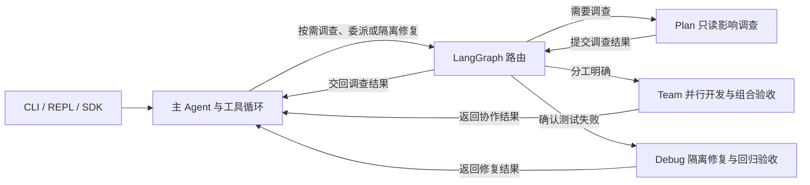
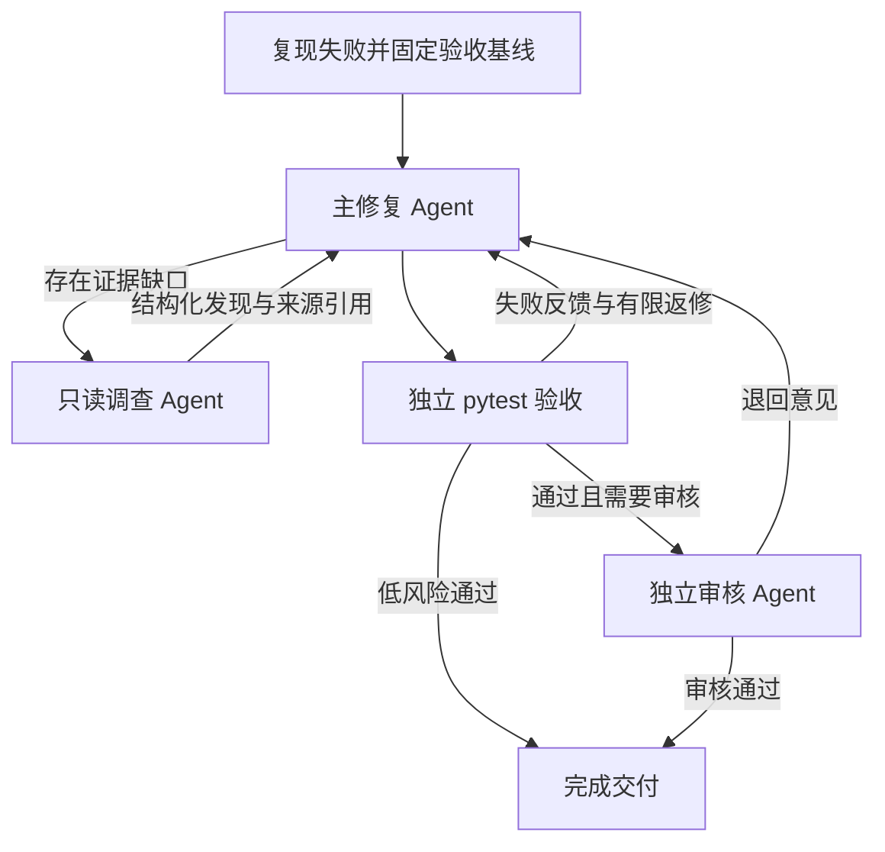

# PaiCLI

**在终端里阅读代码、规划改动和协作开发。**

[](pyproject.toml)
[](LICENSE)

PaiCLI 是一个终端编程 Agent，提供交互式 CLI 和 Python SDK。进入项目后可以直接提问、让 Agent 阅读代码，或描述需要实现的改动。主 Agent 会按任务需要调查改动范围、委派可独立交付的模块，或对可复现的 pytest 失败执行隔离修复与回归验收。

**核心技术**：Python、LangGraph、asyncio、Tool Calling、MCP、SQLite/FTS5、FastEmbed（多语 E5）、pytest、HTTPX。

[快速开始](#快速开始) · [执行链路](#执行链路) · [Debug 工作流](#debug-工作流) · [项目资料检索](#项目资料检索) · [Python SDK](#python-sdk) · [项目结构](#项目结构)

## 可以做什么

| 能力 | 实现方式 |
| --- | --- |
| 影响范围调查 | 只读检查 Python 调用方与候选测试，再由路由决定交回主 Agent 或启动 Team |
| 多 Agent 协作 | 主 Agent 按需委派调查或实现，Worker 在独立 Git worktree 工作。组合检查通过后才交付补丁 |
| 受控修复 | 主修复 Agent 按需委派只读调查，高风险补丁通过测试后进入独立审核 |
| 回归验收 | 固定测试和执行条件，检查目标失败用例转为通过，以及原通过用例保持通过 |
| 可回查证据 | 原始工具输出和测试结果落盘，角色结论关联来源、行号与源码版本 |
| 长任务控制 | Debug 跨角色共享预算，保存阶段 Checkpoint，可查询运行状态并申请取消 |
| 上下文和记忆 | 滑动窗口、提取式历史摘要、按引用回读，以及按项目隔离的 SQLite 记忆 |
| 项目资料 RAG | 使用本地多语 E5、FTS5/BM25 与 RRF 检索项目规范和排障手册 |
| 工具接入 | 提供文件、搜索与命令工具，通过 MCP 扩展外部能力 |

## 快速开始

需要 Python 3.11 或以上版本及 [uv](https://docs.astral.sh/uv/)。以下命令使用 PowerShell，在仓库根目录运行。

```powershell
git clone https://github.com/dbfbd/paicli-python.git
cd paicli-python
uv sync --locked --extra dev
$env:DEEPSEEK_API_KEY = 'your-key'
uv run --locked --extra dev paicli doctor
```

默认使用 DeepSeek。模型与工具选项可通过用户级 `~/.paicli/config.json` 或目标项目的 `.paicli/config.json` 配置。

### 进入交互会话

```powershell
uv run --locked --extra dev paicli --cwd ../your-project
```

```text
概述这个项目的模块和入口
先只读梳理批量导入的调用路径和相关测试，列出改动方案
/team 并行补齐 CSV 和 JSONL 解析模块，各自运行单测，最后统一验收
请复现并修复 tests/test_example.py::test_case，保持 tests/test_example.py 中其他通过的用例
/help
```

替换示例中的测试文件和用例名称。隔离修复需要目标项目已有 Git 提交。目标项目存在 `.venv` 时，Debug 优先使用该环境，请在其中安装项目依赖和 pytest。修复成功后，工具结果会返回验收情况和运行编号。

## 执行链路

普通输入和 SDK 的 `ask()` 都由主 Agent 处理。主 Agent 先读代码、确认改动范围，再决定自己执行，还是委派带文件范围和验收条件的子任务。委派后，主 Agent 可以继续处理公共入口或准备集成检查。

主 Agent 读取到存在共享依赖的 Python 文件后，可以调用 `plan_change`。LangGraph 先执行只读调查，列出可能受影响的文件、导入关系、候选测试和待确认范围，再回到同一个路由节点。如果影响范围已确认，且任务草案包含可独立启动的子任务，路由会启动 Team。其余情况把调查结果交回主 Agent 继续处理。这个入口默认启用，可在项目配置中设置 `{"plan": {"auto_route": false}}` 来关闭。

会话观察到可复现的 pytest 失败后，可以经路由进入 Debug。候选修复先在独立工作区验收，通过后才应用到主工作区。


```mermaid
flowchart LR
    Request[CLI / REPL / SDK] --> Lead[主 Agent 与工具循环]
    Lead -->|按需调查、委派或隔离修复| Route[LangGraph 路由]
    Route -->|需要调查| Inspect[Plan 只读影响调查]
    Inspect -->|提交调查结果| Route
    Route -->|交回调查结果| Lead
    Route -->|分工明确| Team[Team 并行开发与组合验收]
    Route -->|确认测试失败| Debug[Debug 隔离修复与回归验收]
    Team -->|返回协作结果| Lead
    Debug -->|返回修复结果| Lead
```

### Team 并行开发

可以用 `/team` 或 Python SDK 的 `engine.team()` 显式启动整组任务。Team 需要一个已有初始提交的 Git 仓库。调度器按任务依赖和文件写入范围派工。每个 Worker 在独立的 Git worktree 中实现自己的部分，可以按任务编号发消息、提交修改请求，或向下游发布带 Git 版本的交接代码。

系统把 Worker 补丁组合成一个候选版本。如果是普通会话中的主 Agent 发起委派，候选还会纳入主工作区的跟踪改动和委派时声明的新文件。各模块可以登记自己的检查，跨模块的检查在候选版本上统一运行。连续且明确标记为 `parallel_safe: true` 的独立检查可以并行，各自在同一候选提交的独立工作区运行。

检查失败时，负责该部分的 Worker 可在原会话内按具体报错返修。主 Agent 若发现自己的验收断言与需求冲突，可以记录理由并更正失败检查，再复用已有产物重新验收。组合通过后会保存 `.patch`。应用前会再次核对主工作区，避免应用基于旧文件的补丁。

组合检查和应用补丁沿用现有审批。交互终端可以直接审批，SDK 可传入 `approval_callback`。可在项目配置的 `team` 下设置 `max_active_workers`、`max_worker_turns`、`max_model_calls`、`max_tokens` 和 `timeout`。

## Debug 工作流


```mermaid
flowchart TD
    Baseline[复现失败并固定验收基线] --> Repair[主修复 Agent]
    Repair -->|存在证据缺口| Investigate[只读调查 Agent]
    Investigate -->|结构化发现与来源引用| Repair
    Repair --> Verify[独立 pytest 验收]
    Verify -->|失败反馈与有限返修| Repair
    Verify -->|通过且需要审核| Review[独立审核 Agent]
    Review -->|退回意见| Repair
    Verify -->|低风险通过| Done[完成交付]
    Review -->|审核通过| Done
```

主修复 Agent 保留修复会话。互不重叠的调查可以并行，并发数由 `team.max_active_workers`（默认 5）和剩余预算决定。重叠范围会合并。调查结论携带证据引用，程序核对产物完整性和对应源码版本。

Harness 在工具执行层限制权限与写入范围。Debug 允许修改项目中已有的应用 Python 文件，测试、配置与依赖清单受保护。同一项目的 Debug 任务通过文件锁协调写入。

独立 pytest Verifier 检查目标失败用例是否转为通过（F2P），以及基线中已通过的用例是否保持通过（P2P）。失败信息或审核意见会送回修复会话。连续返修根据补丁、失败用例和源码证据检测停滞，先收敛到主修复 Agent，仍无进展则结束。

### 预算、证据与取消

```powershell
uv run --locked --extra dev paicli runs list
uv run --locked --extra dev paicli runs show RUN_ID
uv run --locked --extra dev paicli runs cancel RUN_ID
```

将 `RUN_ID` 替换为实际运行编号。阶段 Checkpoint 记录进度、累计用量、文件版本和证据引用，可结合运行记录追查复现、返修和验收过程。

预算在新增请求前检查，最后一个在途请求的实际用量可能超过门槛。调查超时可交回已有证据，必要审核完成后才会应用补丁。

### 单独使用测试验收

可以自行修改源码，再使用同一套基线与验收机制。

```powershell
uv run --locked --extra dev paicli verify baseline tests/test_example.py --cwd ../your-project --json
uv run --locked --extra dev paicli verify check BASELINE_RUN_ID --json
```

两条命令之间完成源码修改，第二条使用第一条返回的基线编号。

## 项目资料检索

修复需要参考项目约定、接口规范或排障手册时，可以显式建立资料索引。

```powershell
uv sync --locked --extra dev --extra retrieval
uv run --locked --extra dev --extra retrieval paicli knowledge index docs --cwd ../your-project
uv run --locked --extra dev --extra retrieval paicli knowledge search '重复请求如何处理' --cwd ../your-project --k 3
```

`docs` 应替换为项目内的 Markdown、TXT、RST 文件或目录。首次建索引下载本地多语 E5 模型。检索经 RRF 融合后返回路径、行号和文件哈希，过滤已变化的来源。文档更新后重新运行建索引命令。

找到相关资料后，可以把路径和行号带入开发任务，供 Agent 读取和核对。

## 上下文、记忆与工具

- **上下文**按完整工具批次保留近期消息，旧历史生成提取式摘要，保留任务目标和证据引用。长输出落盘供后续回读。
- **项目记忆**以 SQLite 按项目保存偏好与约束，匹配采用有容量限制的 LRU/TTL 缓存，记录更新后失效。
- **MCP Client**读取用户级或项目级 `.paicli/mcp.json`，连接、握手和请求受超时控制，单个服务加载失败时保留其他工具。
- **精确编辑**在旧文本匹配多处时返回候选行号，可通过更完整的上下文或行范围定位。
- **工具错误反馈**区分参数、超时、权限和服务异常。读取失败时提示选择能读取同一来源的备用工具，写操作超时提示先核实是否生效。

使用 `paicli mcp list` 查看配置，使用 `paicli mcp serve --transport stdio` 对外提供内置工具。实际工具范围由入口和角色决定。

## Python SDK

在项目环境运行，将目录替换为自己的项目。

```python
import asyncio

from paicli.sdk import create_default_engine


async def main():
    engine = create_default_engine(cwd="../your-project")
    result = await engine.ask_complete_async("概述这个项目的模块和入口")
    print(result.text)


asyncio.run(main())
```

`engine.ask()` 和 `engine.team()` 提供异步事件流，可消费任务进度、工具执行和最终状态。普通任务使用 `ask()`，其中的主 Agent 会按需进入 Plan 或 Debug。

## 可选 Runtime 服务

普通任务和显式 Team 任务均可通过 HTTP Runtime 提交，由 SQLite 持久化队列处理。

```powershell
$env:PAICLI_RUNTIME_API_KEY = 'your-runtime-key'
uv run --locked --extra dev paicli serve --cwd ../your-project --port 8080
```

服务提供 `/v1/threads` 与 `/v1/tasks` 等入口，请求使用 Bearer 鉴权。也可单独启动 `paicli worker --cwd ../your-project --workers 2`。升级前已排队的 Plan 任务由普通入口继续处理。

## 项目结构

```text
src/paicli/
├── agent/         查询循环、自动路由、Team 调度与 Debug 状态图
├── harness/       任务契约、证据、pytest 验收与运行控制
├── context/       请求预算、滑动窗口与历史摘要
├── memory/        持久记忆与召回缓存
├── rag/           项目资料检索与代码定位
├── tools/         工具与执行器
├── mcp/           MCP Client 与 Server
├── runtime/       HTTP 接口和持久任务队列
├── entrypoints/   CLI、REPL 和专用子命令
└── sdk.py         Python SDK 入口
```

## 适用范围

- Debug 面向存在可复现 pytest 失败的本地 Python 项目，覆盖取决于指定目标和关联测试范围。
- 资料检索面向小型本地语料，向量保存在 SQLite 并做有界精确检索。
- 程序级权限、预算与证据检查按具体入口生效，Debug 的专门约束由协调器和 Harness 实施。

## 许可证

本项目采用 [MIT License](LICENSE)。
